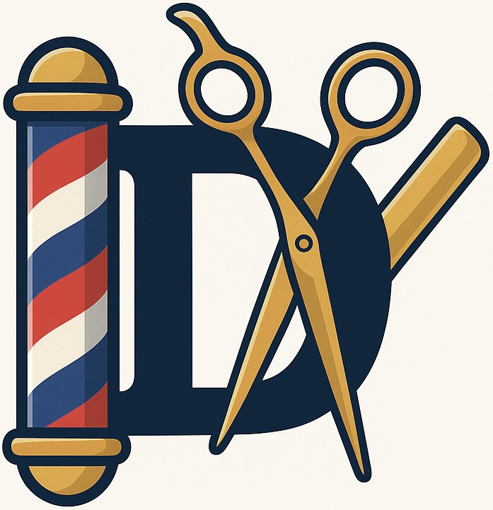

# Barbershop RedBrain

---
## Проект в активной разработке, план завершения первой версии: февраль 2026
---

## Документация
- ✅[1. Анализ предметной области](docs/1-Domain_Analysis.pdf)
- 🔴[2. Техническое задание]()
- ✅[3. Сравнительный анализ инструментов разработки](docs/3-Tool_comparison.pdf)
- ✅[Технологический стек](docs/technology_stack.md)
- ✅[4. Схема архитектуры системы](docs/4-arch.md)
- ✅[Схема базы данных](docs/4_1-erd.md)
- 🟠[5. Проектирование интерфейса](docs/5-figma_interface_design.md)
- 🟠[6. Подключение интеграции](docs/6-integration.md)
- ✅[7. Чек-листы тестирования](docs/7_1-check_list.md) | [Тест-кейсы]()
- 🔴[8. Юнит-тесты]()
- 🔴[9. Генерация тестовых данных]()
- 🔴[10. Пользовательская документация]()

<!-- Картинка по центру размером 400x400 -->

  

